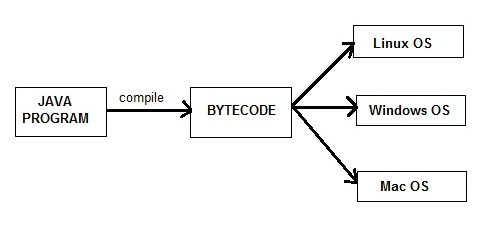
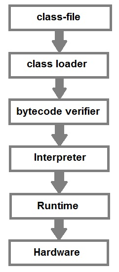

# Java Basics

# 1. Overview of Java

Java is a high level, robust, object-oriented and a secure and stable programming language but it is not a pure object-oriented language because it supports primitive data types like int, char etc.

Java is a platform-independent language because it has runtime environment i.e JRE and API. Here platform means a hardware or software environment in which anapplication runs.

Java codes are compiled into byte code or machine-independent code. This byte code is run on JVM (Java Virtual Machine).

The syntax is Java is almost the same as C/C++. But java does not support low-level programming functions like pointers. The codes in Java is always written in the form of Classes and objects.


## Creation of Java

Java was developed by James Ghosling, Patrick Naughton, Mike Sheridan at Sun Microsystems Inc. in 1991. It took 18 months to develop the first working version.

The initial name was Oak but it was renamed to Java in 1995 as OAK was a registered trademark of another Tech company.

## History of Java

Originally Java was designed for Interactive television, but this technology was very much advanced for the industry of digital cable television at that time. Java history was started with the Green Team. The Green Team started a project to develop a language for digital devices such as television. But it works best for internet programming. After some time Java technology was joined by Netscape.

The objective to create Java Programming Language was it should be "Simple, Robust, Portable, Platform-independent, Secured, High Performance, Multithreaded, Object-Oriented, Interpreted, and Dynamic".

Java was developed in Sun Microsystem by James Ghosling, Patrick Naughton, Mike Sheridan in 1991. It took 18 months to develop the first working version. James Ghosling is also known as the Father of Java.

Initially, Java was called "Greentalk" by James Gosling and at that time the file extension was .gt.

Later on Oak was developed as a part of the Green Team project. Oak is a symbol for strength and Oak is also a national tree in many countries like the USA, Romania etc.

Oak was renamed as Java in 1995 because Oak was already a trademark by Oak Technologies. Before selecting the Java word the team suggested many names like dynamic, revolutionary, Silk, jolt, DNA, etc.

Java is an island in Indonesia, here the first coffee was produced or we call Java coffee. Java coffee is a type of espresso bean. James gosling chose this name while having coffee near his office.

The word JAVA does not have an acronym. It is just a name.

In 1995 Java was one of the best product by the Time magazine.

## Java Version History

- Java Alpha and Beta 1995. It was the 1st version but was having unstable APIs and ABIs. 

- JDK 1.0 - Oak - January 1996 - 1st stable version

- ...

- Java SE 17(LTS) - September 2021

## Application of Java

Java is widely used in every corner of world and of human life. Java is not only used in softwares but is also widely used in designing hardware controlling software components. There are more than 930 million JRE downloads each year and 3 billion mobile phones run java.

Following are some other usage of Java :

- Developing Desktop Applications
- Web Applications like Linkedin.com, Snapdeal.com etc
- Mobile Operating System like Android
- Embedded Systems
- Robotics and games etc.

## Types of Java Application

Following are different types of applications that we can develop using Java:

### 1. Standalone Applications

Standalone applications are the application which runs on separate computer process without adding any file processes. The standalone application is also known as Java GUI Applications or Desktop Applications which uses some standard GUI components such as AWT(Abstract Windowing Toolkit), swing and JavaFX and this component are deployed to the desktop. These components have buttons, menu, tables, GUI widget toolkit, 3D graphics etc. using this component a traditional software is developed which can be installed in every machine.

Example: Media player, antivirus, Paint, POS Billing software, etc.

### 2. Web Applications

Web Applications are the client-server software application which is run by the client. Servlets, struts, JSP, Spring, hibernate etc. are used for the development of a client-server application. eCommerce application is also developed in java using eCommerce platform i.e Broadleaf.

Example: mail, e-commerce website, bank website etc.

### 3. Enterprise Application

Enterprise application is middleware applications. To use software and hardware systems technologies and services across the enterprises. It is designed for the corporate area such as banking business systems.

Example: e-commerce, accounting, banking information systems etc.

### 4. Mobile Application
For mobile applications, Java uses ME or J2ME framework. This framework are the cross platform that runs applications across phones and smartphones. Java provides a platform for application development in Android too.

Example: WhatsApp, Xender etc.

# 2. Features of Java

## 1) Simple

Java is easy to learn and its syntax is quite simple, clean and easy to understand.The confusing and ambiguous concepts of C++ are either left out in Java or they have been re-implemented in a cleaner way.

Eg : Pointers and Operator Overloading are not there in java but were an important part of C++.

## 2) Object Oriented

In java, everything is an object which has some data and behaviour. Java can be easily extended as it is based on Object Model. Following are some basic concept of OOP's.

- Object
- Class
- Inheritance
- Polymorphism
- Abstraction
- Encapsulation

## 3) Robust

Java makes an effort to eliminate error prone codes by emphasizing mainly on compile time error checking and runtime checking. But the main areas which Java improved were Memory Management and mishandled Exceptions by introducing automatic Garbage Collector and Exception Handling.

## 4) Platform Independent

Unlike other programming languages such as C, C++ etc which are compiled into platform specific machines. Java is guaranteed to be write-once, run-anywhere language.

On compilation Java program is compiled into bytecode. This bytecode is platform independent and can be run on any machine, plus this bytecode format also provide security. Any machine with Java Runtime Environment can run Java Programs.



## 5) Secure

When it comes to security, Java is always the first choice. With java secure features it enable us to develop virus free, temper free system. Java program always runs in Java runtime environment with almost null interaction with system OS, hence it is more secure.

## 6) Multi Threading

Java multithreading feature makes it possible to write program that can do many tasks simultaneously. Benefit of multithreading is that it utilizes same memory and other resources to execute multiple threads at the same time, like While typing, grammatical errors are checked along.

## 7) Architectural Neutral

Compiler generates bytecodes, which have nothing to do with a particular computer architecture, hence a Java program is easy to intrepret on any machine.

## 8) Portable

Java Byte code can be carried to any platform. No implementation dependent features. Everything related to storage is predefined, example: size of primitive data types

## 9) High Performance

Java is an interpreted language, so it will never be as fast as a compiled language like C or C++. But, Java enables high performance with the use of just-in-time compiler.

## 10) Distributed

Java is also a distributed language. Programs can be designed to run on computer networks. Java has a special class library for communicating using TCP/IP protocols. Creating network connections is very much easy in Java as compared to C/C++.

### New Features of JAVA 8
Below mentioned are some of the core upgrades done as a part of Java 8 release. Just go through them quickly, we will explore them in details later.

Enhanced Productivity by providing Optional Classes feature, Lamda Expressions, Streams etc.
Ease of Use
Improved Polyglot programming. A Polyglot is a program or script, written in a form which is valid in multiple programming languages and it performs the same operations in multiple programming languages. So Java now supports such type of programming technique.
Improved Security and performance.
New Features of JAVA 11
Java 11 is a recommended LTS version of Java that includes various important features. These features includes new and upgrades in existing topic. Just go through them quickly, we will explore them in details later.

includes support for Unicode 10.0.0
The HTTP Client has been standarized
Lazy Allocation of Compiler Threads
Updated Locale Data to Unicode CLDR v33
JEP 331 Low-Overhead Heap Profiling
JEP 181 Nest-Based Access Control
Added Brainpool EC Support (RFC 5639)
Enhanced KeyStore Mechanisms
JEP 332 Transport Layer Security (TLS) 1.3
JEP 330 Launch Single-File Source-Code Programs

## Java Editions

Java Editions or we can say the platform is a collection of programs which helps to develop and run the programs that are written in Java Programming language. Java Editions includes execution engine, compiler and set of libraries. As Java is Platform independent language so it is not specific to any processor or operating system.

### 1. Java Standard Edition
Java Standard edition is a computing platform which is used for development and deployment of portable code that is used in desktop and server environments. Java Standard Edition is also known as Java 2 Platform, Standard Edition (J2SE).

Java Standard Edition has a wide range of APIs such as Java Class Library etc. the best implementation of Java SE is Oracle Corporation’s Java Development Kit (JDK).

### 2. Java Micro Edition
Java Micro Edition is a computing platform which is used for the development and deployment of portable codes for the embedded and mobile devices. Java Micro Edition is also known as Java 2 Platform Micro Edition (J2ME). The Java Micro Edition was designed by Sun Microsystems and then later on Oracle corporation acquired it in 2010.

Example: micro-controllers, sensors, gateways, mobile phones, printers etc.

### 3. Java Enterprise Edition
Java Enterprise Edition is a set of specifications and extending Java SE 8 with features such as distributed computing and web services. The applications of Java Enterprise Edition run on reference runtimes. This reference runtime handle transactions, security, scalability, concurrency and the management of components to be deployed. Java Enterprise Edition is also known as Java 2 Platform Enterprise Edition (J2EE), and currently, it has been rebranded as Jakarta EE.

Example: e-commerce, accounting, banking information systems.

### 4. JavaFX
JavaFX is used for creating desktop applications and also rich internet applications(RIAs) which can be run on a wide variety of devices. JavaFX has almost replaced Swing as the standard GUI library for Java Standard Edition. JavaFX support for desktop computers and web browsers.


# 3. Setting Java Enviroment

An Environment variable is a dynamic "object" on a computer that stores a value(like a key-value pair), which can be referenced by one or more software programs in Windows. Like for Java, we will set an environment variable with name "java" and its value will be the path of the /bin directory present in Java directory. So whenever a program will require Java environment, it will look for the java environment variable which will give it the path to the execution directory.

# 4. Introduction to JVM

Java virtual Machine(JVM) is a virtual Machine that provides runtime environment to execute java byte code. The JVM doesn't understand Java typo, that's why you compile your *.java files to obtain *.class files that contain the bytecodes understandable by the JVM.

- Class Loader : Class loader loads the Class for execution.

- Method area : Stores pre-class structure as constant pool.

- Heap : Heap is a memory area in which objects are allocated.

- Stack : Local variables and partial results are store here. Each thread has a private JVM stack created when the thread is created.

- Program register : Program register holds the address of JVM instruction currently being executed.

- Native method stack : It contains all native used in application.

- Executive Engine : Execution engine controls the execute of instructions contained in the methods of the classes.

- Native Method Interface : Native method interface gives an interface between java code and native code during execution.

- Native Method Libraries : Native Libraries consist of files required for the execution of native code.

## Difference between JDK and JRE

JRE : The Java Runtime Environment (JRE) provides the libraries, the Java Virtual Machine, and other components to run applets and applications written in the Java programming language. JRE does not contain tools and utilities such as compilers or debuggers for developing applets and applications.

JDK : The JDK also called Java Development Kit is a superset of the JRE, and contains everything that is in the JRE, plus tools such as the compilers and debuggers necessary for developing applets and applications.

# 5. My First Java Program

```java
public class Hello {
    public static void main(String[] args) { 
        System.out.println("Hello ! ! !");
    }
}
```

class : class keyword is used to declare classes in Java

public : It is an access specifier. Public means this function is visible to all.

static : static is again a keyword used to make a function static. To execute a static function you do not have to create an Object of the class. The main() method here is called by JVM, without creating any object for class.

void : It is the return type, meaning this function will not return anything.

main : main() method is the most important method in a Java program. This is the method which is executed, hence all the logic must be inside the main() method. If a java class is not having a main() method, it causes compilation error.

String[] args : This represents an array whose type is String and name is args. We will discuss more about array in Java Array section.

System.out.println : This is used to print anything on the console like printf in C language.



# 6. Variable in Java

## What is a Variable?

When we want to store any information, we store it in an address of the computer. Instead of remembering the complex address where we have stored our information, we name that address.The naming of an address is known as variable. Variable is the name of memory location.

## Instance variables in Java

Instance variables are variables that are declare inside a class but outside any method,constructor or block. Instance variable are also variable of object commonly known as field or property. They are referred as object variable. Each object has its own copy of each variable and thus, it doesn't effect the instance variable if one object changes the value of the variable.

```java
class Student
{
    String name;
    int age;
}
```

## Static variables in Java

Static are class variables declared with static keyword. Static variables are initialized only once. Static variables are also used in declaring constant along with final keyword.

```java
class Student
{
    String name;
    int age;
    static int instituteCode=1101;
}
```

### Additional points on static variable:

- static variable are also known as class variable.
- static means to remain constant.
- In Java, it means that it will be constant for all the instances created for that class.
- static variable need not be called from object.
- It is called by classname.static_variable_name

```java 
class Student{
    int a;
    static int id = 35;

    void change(){

        System.out.println(id);
    }
}

public class StudyTonight {
    public static void main(String[] args) {

        Student o1 = new Student();
        Student o2 = new Student();

        o1.change();

        Student.id = 1;
        o2.change();
        Student.id = 0;
        o1.change();
    }
}
```

## Variable Scope in Java

Scope of a variable decides its accessibility throughout the program. As we have seen variables are different types so they have their own scope.

Local variable: Scope of local variable is limited to the block in which it is declared. For example, a variables declared inside a function will be accessible only within this function.

Instance variable: scope of instance variable depends on the access-modifiers **(public, private, default).** 

If variable is declared as **private** then it is accessible within class only.

If variable is declared as **public** then it is accessible for all and throughout the application.

If variable is declared as **default** the it is accessible with in the same package.

# 7. Data type and Identifier

Java language has a rich implementation of data types. Data types specify size and the type of values that can be stored in an identifier.

### In java, data types are classified into two catagories :

- Primitive Data type

- Non-Primitive Data type

## 1) Primitive Data type

A primitive data type can be of eight types :

Primitive Data types:

- char	
- boolean	
- byte	
- short	
- int	
- long	
- float	
- double

Once a primitive data type has been declared its type can never change, although in most cases its value can change. These eight primitive type can be put into four groups


### Integer

This group includes byte, short, int, long

**byte :** It is 1 byte(8-bits) integer data type. Value range from -128 to 127. Default value zero. example: byte b=10;

**short :** It is 2 bytes(16-bits) integer data type. Value range from -32768 to 32767. Default value zero. example: short s=11;

**int :** It is 4 bytes(32-bits) integer data type. Value range from -2147483648 to 2147483647. Default value zero. example: int i=10;

**long :** It is 8 bytes(64-bits) integer data type. Value range from -9,223,372,036,854,775,808 to 9,223,372,036,854,775,807. Default value zero. example: long l=100012;

## Floating-Point Number

This group includes float, double

**float :** It is 4 bytes(32-bits) float data type. Default value 0.0f. example: float ff=10.3f;

**double :** It is 8 bytes(64-bits) float data type. Default value 0.0d. example: double db=11.123;

## Characters

This group represent char, which represent symbols in a character set, like letters and numbers.

**char :** It is 2 bytes(16-bits) unsigned unicode character. Range 0 to 65,535. example: char c='a';

## Boolean

This group represent boolean, which is a special type for representing true/false values. They are defined constant of the language. example: boolean b=true;

## 2) Non-Primitive(Reference) Data type

A reference data type is used to refer to an object. A reference variable is declare to be of specific and that type can never be change.

For example: String str, here str is a reference variable of type String. String is a class in Java. We will talk a lot more about reference data type later in Classes and Object lesson.

# 8. Static and Initializer Block

In Java, the static keyword is used for the management of memory mainly. the static keyword can be used with Variables, Methods, Block and nested class. A static block in a program is a set of statements which are executed by the JVM (Java Virtual Machine) before the main method. At the time of class loading, if we want to perform any task we can define that task inside the static block, this task will be executed at the time of class loading. In a class, any number of a static block can be defined, and this static blocks will be executed from top to bottom.

## static block is executed before the main() method

Static block executes before the main method while executing program. Statements written inside the static block will execute first. However both are static.

# 9. Type Casting

Casting is a process of changing one type value to another type. In Java, we can cast one type of value to another type. It is known as type casting.

```java 
int x = 10;
byte y = (byte)x;
```

In Java, type casting is classified into two types,

- Widening Casting(Implicit)

byte -> short -> int -> long -> float -> double (widening)

- Narrowing Casting(Explicitly done)

double -> float -> long -> int short -> byte (Narrowing)

# 10. Conditional Statement

In Java, if statement is used for testing the conditions. The condition matches the statement it returns true else it returns false. There are four types of If statement they are:

There are four types of if statement in Java:

- if statement
- if-else statement
- if-else-if ladder
- nested if statement


# 11. Switch Statement

In Java, the switch statement is used for executing one statement from multiple conditions. it is similar to an if-else-if ladder.

Switch statement consists of conditional based cases and a default case.

In a switch statement, the expression can be of byte, short, char and int type.

From JDK-7, enum, String can also be used in switch cases.

Following are some of the rules while using the switch statement:

There can be one or N numbers of cases.
The values in the case must be unique.
Each statement of the case can have a break statement. It is optional.

# 12. Loops in Java

Loop is an important concept of a programming that allows to iterate over the sequence of statements.

Loop is designed to execute particular code block till the specified condition is true or all the elements of a collection(array, list etc) are completely traversed.

Java provides mainly three loop based on the loop structure.

- for loop
- while loop
- do while loop

### For Loop

The for loop is used for executing a part of the program repeatedly. When the number of execution is fixed then it is suggested to use for loop. For loop can be categories into two type.

- for loop
- for-each loop

```java 
for(initialization;condition;increment/decrement) {
    //statement 
}
```

## For loop Parameters:

To create a for loop, we need to set the following parameters.

### 1) Initialization
It is the initial part, where we set initial value for the loop. It is executed only once at the starting of loop. It is optional, if we don’t want to set initial value.

### 2) Condition
It is used to test a condition each time while executing. The execution continues until the condition is false. It is optional and if we don’t specify, loop will be inifinite.

### 3) Statement
It is loop body and executed every time until the condition is false.

## 4) Increment/Decrement
It is used for set increment or decrement value for the loop.

Data Flow Diagram of for loop
This flow diagram shows flow of the loop. Here we can understand flow of the loop.

```java
for(int i=1; i <= 10; i++) {
    System.out.println("i= " + i);
}
```

## Example for Nested for loop

```java
for(int i = 1; i <= 5; i++) {
    for(int j = 1; j <= i; j++) {
	    System.out.print("* ");
    }
    System.out.println();
}
```

## for-each Loop

In Java, for each loop is used for traversing array or collection elements. In this loop, there is no need for increment or decrement operator.

```java
int a[] = { 20, 21, 22, 23, 24 };
for (int i : a) {
    System.out.println(i);
}
```

## While Loop

Like for loop, while loop is also used to execute code repeatedly. a control statement. It is used for iterating a part of the program several times. When the number of iteration is not fixed then while loop is used.

```java
int i = 1;
while (i <= 10) {
    System.out.println(i);
    i++;
}
```

## do-while loop

In Java, the do-while loop is used to execute statements again and again. This loop executes at least once because the loop is executed before the condition is checked. It means loop condition evaluates after executing of loop body.

```java
int i = 1;
do {
    System.out.println(i);
    i++;
} while (i <= 10);
```

# 13. Break Continue Statement in Java

## Java break and continue Statements

Java break and continue statements are used to manage program flow. We can use them in a loop to control loop iterations. These statements let us to control loop and switch statements by enabling us to either break out of the loop or jump to the next iteration by skipping the current loop iteration.

```java
for (int i = 1; i <= 10; i++) {
    if ( i == 8) { 
        break;
    }
    System.out.println(i);
}
```

### continue Statement

In Java, the continue statement is used to skip the current iteration of the loop. It jumps to the next iteration of the loop immediately. We can use continue statement with for loop, while loop and do-while loop as well.

```java
for (int i = 1; i <= 10; i++) {
	if (i == 5) {
	    continue;
	}
	System.out.println(i);
}
```


# 14. Operators in Java

Operator is a symbol which tells to the compiler to perform some operation. Java provides a rich set of operators do deal with various types of operations. Sometimes we need to perform arithmetic operations then we use plus (+) operator for addition, multiply(*) for multiplication etc.

Java operators can be divided into following categories:

- Arithmetic operators
- Relation operators
- Logical operators
- Bitwise operators
- Assignment operators
- Conditional operators
- Misc operators

## Arithmetic operators

Operator	Description

(+)	adds two operands

(-)	subtract second operands from first

(*)	multiply two operand

(/)	divide numerator by denumerator

(%)	remainder of division

(++)	Increment operator increases integer value by one

(--)	Decrement operator decreases integer value by one

## Relation operators

The following table shows all relation operators supported by Java.

Operator	Description

(==)	Check if two operand are equal

(!=)	Check if two operand are not equal.

(>)	Check if operand on the left is greater than operand on the right

(<)	Check operand on the left is smaller than right operand

(>=)	check left operand is greater than or equal to right operand

(<=)	Check if operand on left is smaller than or equal to right operand

## Logical operators

Java supports following 3 logical operator. Suppose we have two variables whose values are: a=true and b=false.

Operator	Description	Example

( && )	Logical AND	(a && b) is false

( || )	Logical OR	(a || b) is true

( ! )	Logical NOT	(!a) is false


## Bitwise operators

Bitwise operators are used to perform operations bit by bit.

Java defines several bitwise operators that can be applied to the integer types long, int, short, char and byte.

The following table shows all bitwise operators supported by Java.

Operator	Description

( & )	Bitwise AND

( | )	Bitwise OR

( ^ )	Bitwise exclusive OR

( << )	left shift

( >> )	right shift

## Assignment Operators

operator supported by Java are as follows:

Operator	Description	Example

( = )	assigns values from right side operands to left side operand	a = b

( += )	adds right operand to the left operand and assign the result to left	a+=b is same as a=a+b

( -= )	subtracts right operand from the left operand and assign the result to left operand	a-=b is same as a=a-b

( *= )	mutiply left operand with the right operand and assign the result to left operand	a*=b is same as a=a*b

( /= ) 	divides left operand with the right operand and assign the result to left operand	a/=b is same as a=a/b

( %= ) 	calculate modulus using two operands and assign the result to left operand	a%=b is same as a=a%b

## Misc. operator

There are few other operator supported by java language.

Conditional operator

It is also known as ternary operator because it works with three operands. It is short alternate of if-else statement. It can be used to evaluate Boolean expression and return either true or false value

> epr1 ? expr2 : expr3

```java
int a, b;
a = 20;
b = (a == 1) ? 30: 40;
System.out.println( "Value of b is : " +  b );

b = (a == 20) ? 30: 40;
System.out.println( "Value of b is : " + b );
```

## instanceOf operator

It is a java keyword and used to test whether the given reference belongs to provided type or not. Type can be a class or interface. It returns either true or false.

```java
String a = "Studytonight";
boolean b = a instanceof String;
System.out.println( b );
// true
```

# 15. Java Array

An array is a collection of similar data types. Array is a container object that hold values of homogeneous type. It is also known as static data structure because size of an array must be specified at the time of its declaration.

Array starts from zero index and goes to **n-1** where n is length of the array.

### Features of Array

- It is always indexed. Index begins from 0.
- It is a collection of similar data types.
- It occupies a contiguous memory location.
- It allows to access elements randomly.

```java
int[ ] arr;
char[ ] arr;
short[ ] arr;
long[ ] arr;
int[ ][ ] arr;   // two dimensional array.
```

```java
int[] arr = {10,20,30,40,50};
for (int x : arr) {
    System.out.println(x);
}
// 10
// 20
// 30
// 40
// 50
```

```java
int[] arr = {10,20,30,40,50}; 
```

```java 
int[] arr = {10,20,30,40,50}; 
for (int i = 0; i < arr.length; i++) {
    System.out.println(arr[i]);
}
```

## Multi-Dimensional Array

```java
int[ ][ ] arr = {{1,2,3,4,5},{6,7,8,9,10},{11,12,13,14,15}};
```

```java
int arr[ ][ ] = {{1,2,3,4,5},{6,7,8,9,10},{11,12,13,14,15}};
for(int i = 0; i < 3; i++)
{
    for (int j = 0; j < 5; j++) {
        System.out.print(arr[i][j]+" ");
    }
    System.out.println();
}
// 1 2 3 4 5
// 6 7 8 9 10
// 11 12 13 14 15
// element at first row and second column: 2
```

## Jagged Array

Jagged array is an array that has different numbers of columns elements. In java, a jagged array means to have a multi-dimensional array with uneven size of columns in it.

```java
int arr[ ][ ] = { {1,2,3},{4,5},{6,7,8,9} };
for(int i = 0; i < 3; i++)
{
    for (int j = 0; j < arr[i].length; j++) {
        System.out.print(arr[i][j]+" ");
    }
    System.out.println();
}
// 1 2 3
// 4 5
// 6 7 8 9
```

16. Ways to create object in Java

Java is an object-oriented language, everything revolve around the object. An object represents runtime entity of a class and is essential to call variables and methods of the class.

To create an object Java provides various ways that we are going to discuss in this topic.

- New keyword
- New instance
- Clone method
- Deserialization
- NewInstance() method

## 1) new Keyword

```java
public class NewKeyword
{ 
    String s = "studytonight";
    public static void main(String as[])  
    { 
        NewKeyword a = new NewKeyword(); 
        System.out.println(a.s); 
    }
}
```

## 2) New Instance

```java
public class NewInstance
{ 
    String a = "studytonight"; 
    public static void main(String[] args) { 
        try { 
            Class b = Class.forName("NewInstance"); 
            NewInstance c = (NewInstance) b.newInstance(); 
            System.out.println(c.a); 
        } 
        catch (ClassNotFoundException e) { 
            e.printStackTrace(); 
        } 
        catch (InstantiationException e) { 
            e.printStackTrace(); 
        } 
        catch (IllegalAccessException e) { 
            e.printStackTrace(); 
        } 
    } 
}
```

## 3) Clone() method

```java
public class CloneEg implements Cloneable
{ 
    @Override
    protected Object clone() throws CloneNotSupportedException { 
        return super.clone(); 
    } 
    String s = "studytonight"; 
    public static void main(String[] args) { 
        CloneEg a= new CloneEg(); 
        try { 
            CloneEg b = (CloneEg) a.clone(); 
            System.out.println(b.s); 
        } 
        catch (CloneNotSupportedException e) { 
            e.printStackTrace(); 
        } 
    } 
}
```

## 4) deserialization

```java
import java.io.*; 

class DeserializationEg implements Serializable { 
    private String a; 
    DeserializationEg(String name) { 
        this.a = a; 
    }
    public static void main(String[] args) { 
        try { 
            DeserializationEg b = new DeserializationEg("studytonight"); 
            FileOutputStream c = new FileOutputStream("CoreJava.txt"); 
            ObjectOutputStream  d = new ObjectOutputStream(c); 
            d.writeObject(b); 
            d.close(); 
            d.close(); 
        } 
        catch (Exception e) { 
            e.printStackTrace(); 
        } 
    } 
}
```

## 17. Command line Argument

The command line argument is the argument that passed to a program during runtime. It is the way to pass argument to the main method in Java. These arguments store into the String type args parameter which is main method parameter.

> java HelloWorld arg1 arg2 ...

> java cmd 10 20 30

```java
> java cmd 10 20 30 

class cmd {
    public static void main(String[] args) {
        for(int i = 0; i < args.length; i++) {
            System.out.println(args[i]);
        }
    }
}
// 10
// 20
// 30
```

## Java System.exit() Method

In Java, exit() method is in the java.lang.System class. This method is used to take an exit or terminating from a running program. It can take either zero or non-zero value. exit(0) is used for successful termination and exit(1) or exit(-1) is used for unsuccessful termination. The exit() method does not return any value.

```java
import java.util.*; 
import java.lang.*; 

class ExitDemo1 { 
    public static void main(String[] args) { 
        intx[] = {5, 10, 15, 20, 25, 30, 35, 40, 45, 50}; 
        for (inti = 0; i<x.length; i++) { 
            if (x[i] >= 40) { 
                System.out.println("Program is Terminated..."); 
                System.exit(0); 
            } else {
                System.out.println("x["+i+"] = " + x[i]); 
            }
        } 
    } 
}
```

https://www.studytonight.com/java/overview-of-java.php

